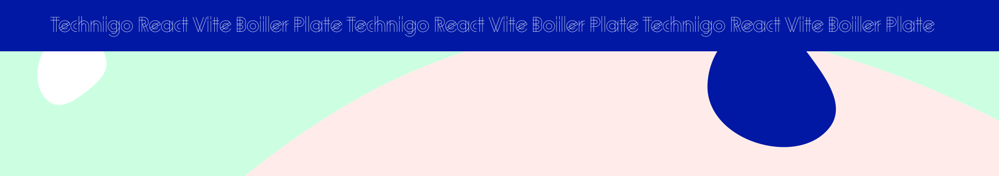

 

# React Vite Moment.js Boilerplate

Welcome to the React Vite `Third-Party Moment.js`!

This boilerplate is designed to kickstart your React projects, providing a solid foundation with one of the most popular third-party libraries integrated for a smooth development experience.

## Getting Started

1.  Clone the repository to your local machine.
2.  Install the required dependencies using `npm install`.
3.  Start the development server using `npm run dev`.

## Navigating the Repository

### 📅 Moment.js

The `src/commponents/Moment` directory contains configurations to utilize [Moment.js](https://momentjs.com/) to parse, validate, manipulate, and display dates and times in JavaScript. Check out the `src/utils` directory for utility functions that might use Moment.js for date manipulations.

---

Tip: Before you decide to delete all components and start from scratch, we suggest examining them closely to grasp their structure. They can act as a blueprint for your future work.

---

We hope this guide helps you navigate and make the most out of this boilerplate.

Happy coding, Technigo students!
